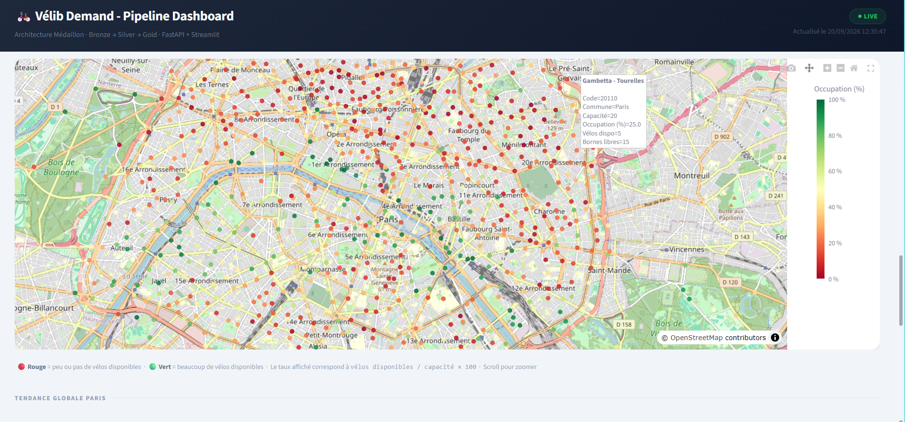
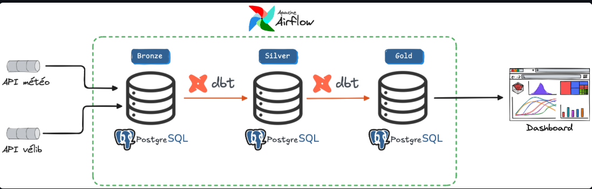
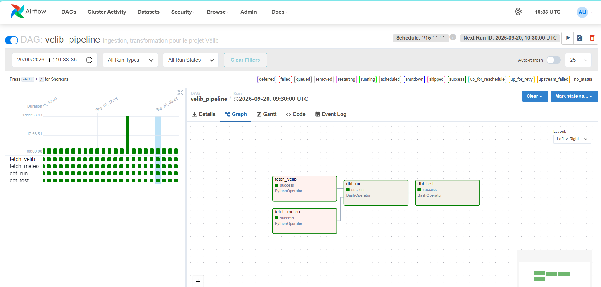

# Vélib' Weather Pipeline

> Influence de la météo sur la disponibilité des stations Vélib' à Paris — pipeline de données ELT orchestré, avec dashboard temps réel.

<!-- Remplace par une capture du dashboard Streamlit -->


## 🎯 Contexte

<!-- 2-3 phrases : pourquoi ce projet, quelle question il répond -->
Ce projet ingère les données en temps réel des stations Vélib' (Open Data Paris) et les données météo (Open Meteo), les transforme via une architecture medallion (staging → intermediate → marts), et expose le résultat dans un dashboard interactif avec carte des stations et tendances historiques.

## 🏗️ Architecture




## 🛠️ Stack technique

| Couche | Outil |
|---|---|
| Ingestion | Python, requests |
| Stockage | PostgreSQL |
| Transformation | dbt (staging / intermediate / marts) |
| Orchestration | Apache Airflow |
| API | FastAPI |
| Visualisation | Streamlit |
| Conteneurisation | Docker / Docker Compose |
| Gestion de dépendances | uv |
| Langages | Python, SQL|

## 📂 Structure du projet

```
├── ingestion/       # Fetchers Vélib' + météo
├── dbt/             # Transformations staging → intermediate → marts
├── airflow/         # DAGs et orchestration
├── dashboard/        # API FastAPI + app Streamlit
└── postgres/        # Schémas d'initialisation
```

### Orchestration reussie 


## 🚀 Lancer le projet en local

```bash
git clone <url-du-repo>
cd velib-weather-pipeline
cp dbt/profiles.yml.example dbt/profiles.yml   # à compléter
docker compose up -d
```

- Airflow UI : http://localhost:8080
- Dashboard : http://localhost:8501
- API : http://localhost:8000/docs

## 📊 Résultats

<!-- Ce que montre concrètement le dashboard -->
- Carte en temps réel de la disponibilité des stations Vélib' à Paris
- Corrélation entre conditions météo et taux d'occupation des stations
- Tendances historiques par station / par période

## 🐛 Défis techniques rencontrés

<!-- 2-4 bullets, base-toi sur tes vrais bugs -->
- **Bug de vue dbt silencieux** : une erreur de timezone invalide passait `dbt run` (les vues ne sont exécutées qu'à la lecture) et n'était détectée qu'au `dbt test`. Diagnostiqué via `pg_get_viewdef()`.
- **Contrainte transactionnelle PostgreSQL** : `CREATE DATABASE` nécessite `autocommit=True` car les DDL ne peuvent pas s'exécuter dans un bloc de transaction.
- **Migration APScheduler → Airflow** : passage d'un scheduler interne (`BlockingScheduler`) à une planification déclarative via le paramètre `schedule` du DAG, avec des scripts transformés en fonctions single-run.

## 🔭 Prochaines étapes

- [ ] Migration cloud (en cours)

## 📄 Licence

<!-- MIT, ou autre -->